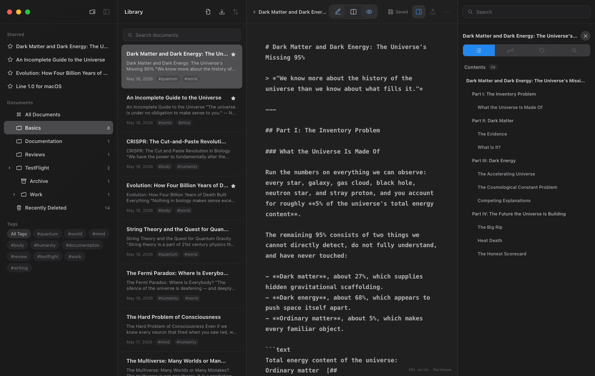

<p align="center">
  
</p>

<h1 align="center">Line</h1>

<p align="center">
  A calm Markdown workspace for macOS.
</p>



## Stay in flow

- Write in editor, split, or preview mode.
- Find work with search, tags, stars, and a live outline.
- Keep work safe with local recovery and conflict-aware saves.

## Run locally

```bash
npm install
npm run dev
```

```bash
npm test
npm run typecheck
npm run build
```

Build the macOS app with `npm run dist`. Installers are written to `builds/`.

<p align="center">
  <sub>Electron · React · TypeScript · Vite</sub>
</p>
