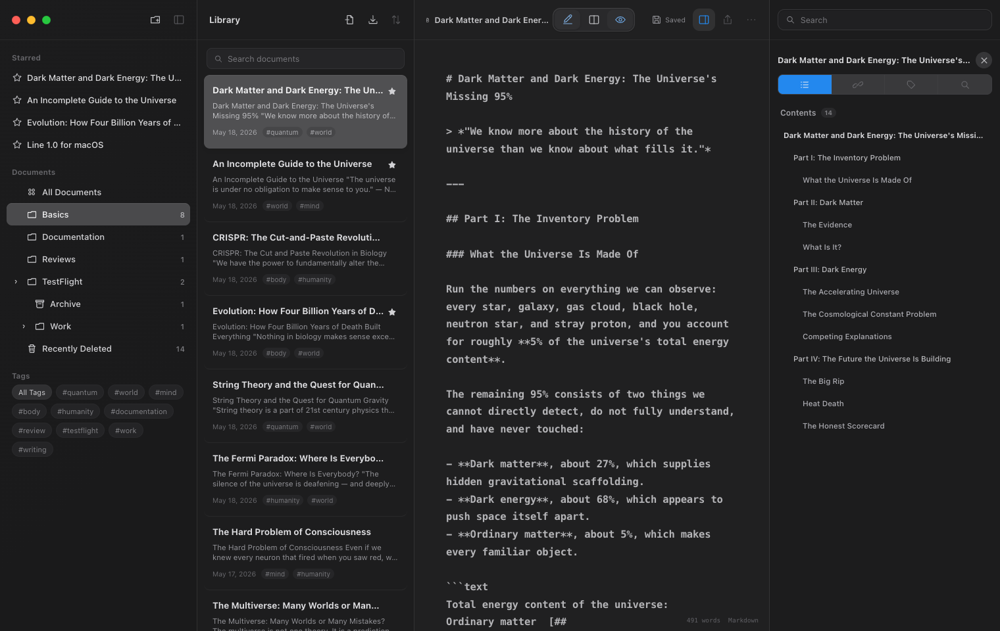

<p align="center">
  
</p>

<h1 align="center">Line</h1>

<p align="center">
  Personal Markdown notes for macOS.<br>
  <sub>Electron · React 19 · TypeScript · Vite · v1.0.1</sub>
</p>

<p align="center">
  
</p>

## What you can do

- Write, split, or preview. Preview renders honest `` for http(s) and root-relative sources. It rejects `javascript:` and `data:`. An empty preview shows a write cue.
- Search the library, filter by tags parsed from markdown, and star notes. There is no cap on starred items.
- Use the outline inspector. Other inspector tabs stay hidden.
- Recover the library from `line.library.v1` in localStorage after a bad quit.
- Save atomically when a path is granted this session. Conflict-aware writes refuse to clobber a file changed on disk.
- Delete removes a note from the library only, not from disk. An undo toast can restore the last remove.
- Open files from Finder, Dock, argv, or a second instance. Open and save errors land in the existing banner. The Saving chip appears only during real writes.
- Cmd/Ctrl+F stays in the markdown textarea when it is focused. Otherwise it focuses library search.
- Closing with unsaved changes asks first. Close is async and does not fail silently.

Ghost tags drop when unused. All Documents clears an active tag filter. Dead chrome (sidebar toggle, sort, share, more-options, extra inspector tabs) is hidden.

## Files and sessions

File bindings last for the session only. The persisted library stores `path` as null. After relaunch, a previously open note shows **Not linked — Save As**. Save without a granted path opens Save As. There are no security-scoped bookmarks.

**Unlinked** notes have no disk path. They live for the session. A sidebar filter appears when the count is greater than zero. The library heading reads Unlinked, `#tag`, or Library depending on the active filter.

Packaged builds land under `builds/`. The Jul 14 1.0.0 app is `builds/mac-arm64/Line.app`. Later unsigned builds may sit in versioned folders. Do not overwrite an older install in place.

## Run, test, dist

```bash
npm install
npm run dev
```

```bash
npm test
npm run typecheck
npm run build
```

```bash
npm run dist
```

`npm run dist` builds an unsigned macOS app (`dmg.sign` is false). Output goes to `builds/`.

## Changelog

### 1.0.1 (2026-08-20)

Honesty and feel after the first public build.

- Search and tag filters no longer steal the open note.
- Create lands in edit mode.
- Narrow panes stay visible instead of collapsing away.
- Relinked UI copy: **Not linked — Save As**.
- Dead chrome hidden.
- Ghost tag filter cleanup; All Documents clears an active tag.
- Delete from library with undo toast.
- Finder / Dock / argv / single-instance intake.
- Dirty relaunch no longer claims Saved.
- Inspector Outline is one column; outline jump uses frontmatter and measured line height.
- Unlinked filter and library heading modes.
- Empty preview write cue.
- Cmd/Ctrl+F no longer steals focus from the editor.
- Snappier list entrance (no stagger).
- Open/save honesty: partial open, persist-fail banner, Saving only after a chosen path, async close.

### 1.0.0 · 2026-07-14

First public release.

- Write / split / preview modes.
- Library search, tags, stars, outline.
- localStorage library recovery.
- Atomic, conflict-aware disk saves.
- Unsaved-close dialog.
- Finder opens and macOS title bar chrome.

### Main after 1.0.1

Shipped on main, not yet cut as a new version.

- Honest markdown image preview (`http(s)` and root-relative; reject `javascript:` / `data:`).
- Starred sidebar shows every favorite (no slice to four).
