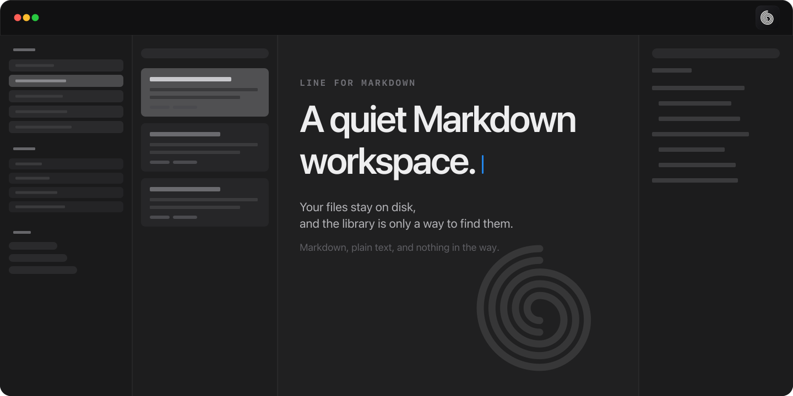

<p align="center">
  
</p>

<p align="center">
  
</p>

<p align="center">
  <sub>Library, source, outline. Files stay on disk. Kept on this Mac. Nothing is sent anywhere.</sub>
</p>

## On disk, or it isn't yours

<table>
<tr>
<td width="62%" valign="top">

**Your files are files.**
The library is an index. Delete removes the row, not the path. If the note is not on disk, it is not yours yet.

</td>
<td width="38%" valign="top">

**Preview will not lie.**
`http(s)` and root-relative images. No `javascript:`. No `data:`. An empty preview says Start writing in Markdown…

</td>
</tr>
</table>

<table>
<tr>
<td width="38%" valign="top">

**Starred has no cap.**
There was never a reason for one. Inspector is Outline and Stats, off until you want it.

</td>
<td width="62%" valign="top">

**We hid the chrome that looks like work.**
No share sheet. Ghost tags drop when unused. All Documents clears a tag filter. There is no account, no graph, and no weekly digest of your thinking.

</td>
</tr>
</table>

<p align="center">
  <kbd>⌘N</kbd> New document&nbsp;&nbsp;&nbsp;<kbd>⌘S</kbd> Save to disk&nbsp;&nbsp;&nbsp;<kbd>⌘3</kbd> Preview
</p>

## Run it

Clone it, install, run `npm run dev`. Packaging is an unsigned macOS `dmg` and `zip`. Output lands in `builds/`. Gatekeeper will side-eye it. That is accurate, not a bug.

```bash
npm install
npm run dev
```

```bash
npm test
npm run typecheck
npm run build
```

```bash
npm run dist
```

`npm run dist` sets `dmg.sign` false. Do not overwrite an older install in place. Packaged builds land under `builds/`. The Jul 14 1.0.0 app is `builds/mac-arm64/Line.app`. Later unsigned builds may sit in versioned folders.

## Files and sessions

Line does not sync. Your disk already does what you asked it to.

- File bindings last for the session only. The persisted library stores `path` as null. After relaunch, a previously open note shows **Not linked — Save As**. Save without a granted path opens Save As. There are no security-scoped bookmarks. That is the product.
- Unlinked notes have no disk path. They live for the session. A sidebar filter appears when the count is greater than zero. The library heading reads Unlinked, `#tag`, or Library depending on the active filter.
- Save is atomic when a path is granted this session. Conflict-aware writes refuse to clobber a file changed on disk. Autosave only after a file is actually linked.
- Delete removes a note from the library only, not from disk. An undo toast can restore the last remove.
- Open files from Finder, Dock, argv, or a second instance. Open and save errors land in the existing banner. The Saving chip appears only during real writes.
- Closing with unsaved changes asks first. Close is async and does not fail silently.
- Recover the library from `line.library.v1` in localStorage after a bad quit.
- `⌘F` stays in the markdown textarea when it is focused. Otherwise it focuses library search.

Line is not a cloud notebook, not Obsidian, not signed, and not a file watcher that keeps writing to last week's path.

## Changelog

<details>
<summary>2.0.0 - honest image preview, starred without a cap</summary>

### 2.0.0 (2026-08-20)

- Honest markdown image preview for `http(s)` and root-relative sources. Rejects `javascript:` and `data:`.
- Starred sidebar shows every favorite. No four-item cap.
- First-open, focus mode, inspector stats, library sort, duplicate, copy HTML, Show in Finder, and autosave for linked files.

### 1.0.1 (2026-08-20)

Honesty and feel after the first public build.

- Search and tag filters no longer steal the open note.
- Create lands in edit mode.
- Narrow panes stay visible instead of collapsing away.
- Relinked UI copy: **Not linked — Save As**.
- Dead chrome hidden.
- Ghost tag filter cleanup; All Documents clears an active tag.
- Delete from library with undo toast.
- Finder / Dock / argv / single-instance intake.
- Dirty relaunch no longer claims Saved.
- Inspector Outline is one column; outline jump uses frontmatter and measured line height.
- Unlinked filter and library heading modes.
- Empty preview write cue.
- Cmd/Ctrl+F no longer steals focus from the editor.
- Snappier list entrance (no stagger).
- Open/save honesty: partial open, persist-fail banner, Saving only after a chosen path, async close.

### 1.0.0 (2026-07-14)

First public release.

- Write / split / preview modes.
- Library search, tags, stars, outline.
- localStorage library recovery.
- Atomic, conflict-aware disk saves.
- Unsaved-close dialog.
- Finder opens and macOS title bar chrome.

</details>

<p align="center">
  <sub>Electron, React 19, TypeScript, Vite. v2.0.0</sub>
</p>
